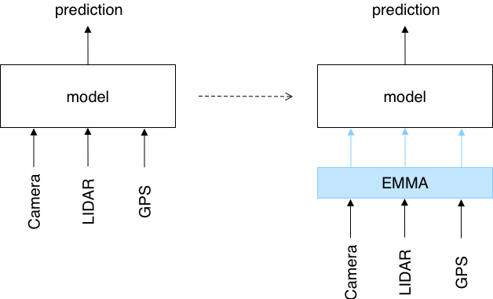
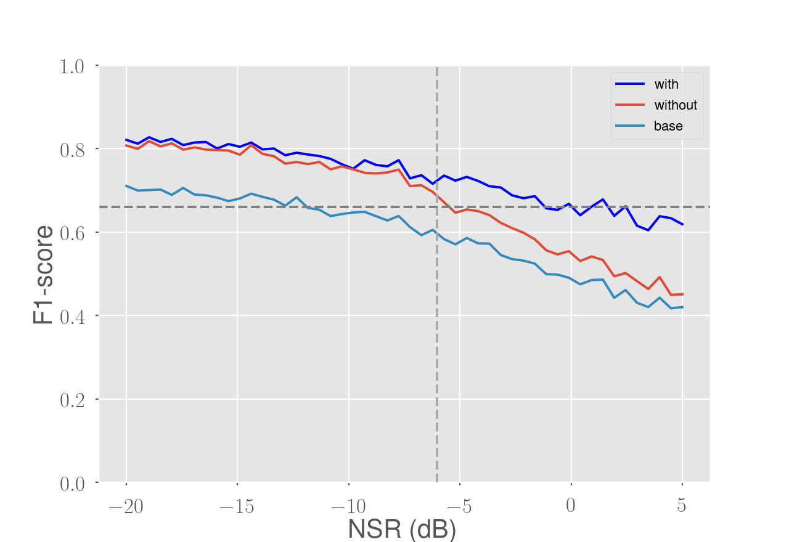
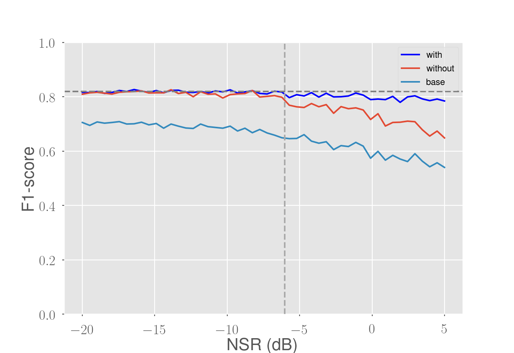

# Energy-based Multi-Modal Attention (EMMA)

This repository contains the implementation for my thesis 'Energy-based Multi-Modal Attention' done at the Montefiore (Computer & Electrical Engineering) Institute of the University of Liège. The up-to-date report can be found [here](https://github.com/Werenne/energy-based-multimodal-attention/blob/master/report/main.pdf).

Author: Aurélien Werenne<br />
Supervisor: Dr. Raphaël Marée  

## Motivation

A multi-modal neural network exploits information from different channels and in different terms (e.g., images, text, sounds, sensor measures) in the hope that the information carried by each mode is complementary, in order to improve the predictions of the neural network. Nevertheless, in realistic situations, varying levels of perturbations can occur on the data of the modes, which may decrease the quality of the inference process. An additional difficulty is that these perturbations vary between the modes and on a sample-per-sample basis. This work presents a solution to this problem. 

## Example

Take the case of a self-driving car using a neural network for scene understanding, receiving at its input data coming simultanously from a camera, LIDAR sensor and a GPS (i.e. multi-modal input). Now, imagine the car being in a snow storm, the quality of the data coming from the LIDAR and GPS will remain unchanged, whereas, the one from the camera will be decreased. As a consequence, predictions of the model will be negatively affected (unless the training set explicitly contains sufficient samples of snow storms).

The proposed solution is to couple the prediction model with an attention module. The role of the latter is to indicate to the model which modes of the current sample are important and which ones can be neglected. The idea is to leverage the redundancy of information between the modes, such that if the quality of one mode decreases the other mode(s) can "take over".

<p align="center">
    
</p>

## Results

The main experiment showed that the use of the attention module improves the robustness and generalizes the performance gain on samples with perturbations different from the one simulated in a training set (e.g. snow storm). To this end, a real-world dataset was used with two modes, denoted here **A** and **B**. Perturbations were simulated by adding Gaussian white noise. The common method to improve the robustness of a stand-alone prediction model against those perturbations is to train the model with corrupted samples. 

In the figure below we show the evolution of the performance when increasing the noise-to-signal ratio of mode **A** in the test samples. The vertical dashed line represents the noise-to-signal ratio applied during the training. As can be observed, the stand-alone prediction model trained with corrupted samples (red line) has a good performance until the noise-to-signal ratio of the test samples becomes higher than the one of the training samples. On the other hand, the prediction model coupled with our attention module (blue line) obtains better performance and remains more stable.

<p align="center">
    
</p>

It is worth noticing that the blue line seems to stabilize around the horizontal dashed line, the latter representing the maximal performance that could be attained using only the uncorrupted mode (mode **B**). This can be interpreted as follows: information in the corrupted mode is used to improve the predictions until the amount of perturbations becomes too high. From that point, only the uncorrupted mode is used for predictions. Similarly, the same pattern can be seen when corrupting mode **B**.

<p align="center">
    
</p>

## Usage

The neural networks are implemented using [Pytorch](https://pytorch.org/). Notice that there is still room for improvement of the code; I will try to improve it if I can find the time.

If you find this thesis or code useful, please cite according to the following bib entry,
```
@MastersThesis{Werenne:Thesis:2019,
    author  =  {Aurélien Werenne},
    title  =  {Energy-based Multi-Modal Attention},
    school  =  {University of Liège},
    address  =  {Belgium},
    year  =  {2019}
    }
```


